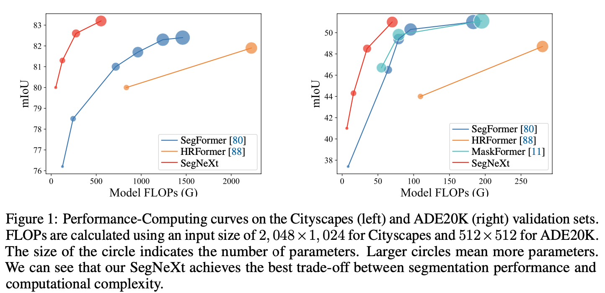

# SegNeXt: Rethinking Convolutional Attention Design for Semantic Segmentation (NeurIPS 2022)



The repository contains official Pytorch implementations of training and evaluation codes and pre-trained models for **SegNext**. 

For Jittor user, https://github.com/Jittor/JSeg is a jittor version. 

The paper is in [Here](https://arxiv.org/pdf/2209.08575.pdf).

The code is based on [MMSegmentaion v0.24.1](https://github.com/open-mmlab/mmsegmentation/tree/v0.24.1).


## Citation
If you find our repo useful for your research, please consider citing our paper:

```
@article{guo2022segnext,
  title={SegNeXt: Rethinking Convolutional Attention Design for Semantic Segmentation},
  author={Guo, Meng-Hao and Lu, Cheng-Ze and Hou, Qibin and Liu, Zhengning and Cheng, Ming-Ming and Hu, Shi-Min},
  journal={arXiv preprint arXiv:2209.08575},
  year={2022}
}


@article{guo2022visual,
  title={Visual Attention Network},
  author={Guo, Meng-Hao and Lu, Cheng-Ze and Liu, Zheng-Ning and Cheng, Ming-Ming and Hu, Shi-Min},
  journal={arXiv preprint arXiv:2202.09741},
  year={2022}
}


@inproceedings{
    ham,
    title={Is Attention Better Than Matrix Decomposition?},
    author={Zhengyang Geng and Meng-Hao Guo and Hongxu Chen and Xia Li and Ke Wei and Zhouchen Lin},
    booktitle={International Conference on Learning Representations},
    year={2021},
}

```

## Results

**Notes**: ImageNet Pre-trained models can be found in [TsingHua Cloud](https://cloud.tsinghua.edu.cn/d/c15b25a6745946618462/).

## Rank 1 on Pascal VOC dataset: [Leaderboard](http://host.robots.ox.ac.uk:8080/leaderboard/displaylb_main.php?challengeid=11&compid=6)

### ADE20K

|   Method  |    Backbone     |  Pretrained | Iters | mIoU(ss/ms) | Params | FLOPs  | Config | Download  |
| :-------: | :-------------: | :-----: | :---: | :--: | :----: | :----: | :----: | :-------: |
|  SegNeXt  |     MSCAN-T  | IN-1K | 160K | 41.1/42.2 | 4M | 7G | [config](local_configs/segnext/tiny/segnext.tiny.512x512.ade.160k.py)  | [TsingHua Cloud](https://cloud.tsinghua.edu.cn/f/5da98841b8384ba0988a/?dl=1) |
|  SegNeXt  |     MSCAN-S | IN-1K  | 160K |  44.3/45.8  | 14M | 16G | [config](local_configs/segnext/small/segnext.small.512x512.ade.160k.py)  | [TsingHua Cloud](https://cloud.tsinghua.edu.cn/f/b2d1eb94f5944d60b3d2/?dl=1) |
|  SegNeXt  |     MSCAN-B  | IN-1K  | 160K |  48.5/49.9 | 28M | 35G | [config](local_configs/segnext/base/segnext.base.512x512.ade.160k.py)  | [TsingHua Cloud](https://cloud.tsinghua.edu.cn/f/1ea8000916284493810b/?dl=1) |
|  SegNeXt  |     MSCAN-L  | IN-1K  | 160K |  51.0/52.1 | 49M | 70G | [config](local_configs/segnext/large/segnext.large.512x512.ade.160k.py)  | [TsingHua Cloud](https://cloud.tsinghua.edu.cn/f/d4f8e1020643414fbf7f/?dl=1) |

### Cityscapes

|   Method  |    Backbone     |  Pretrained | Iters | mIoU(ss/ms) | Params | FLOPs  | Config | Download  |
| :-------: | :-------------: | :-----: | :---: | :--: | :----: | :----: | :----: | :-------: |
|  SegNeXt  |     MSCAN-T  | IN-1K | 160K | 79.8/81.4 | 4M | 56G | [config](local_configs/segnext/tiny/segnext.tiny.1024x1024.city.160k.py)  | [TsingHua Cloud](https://cloud.tsinghua.edu.cn/f/b1613af9955849bba910/?dl=1) |
|  SegNeXt  |     MSCAN-S | IN-1K  | 160K |  81.3/82.7  | 14M | 125G | [config](local_configs/segnext/small/segnext.small.1024x1024.city.160k.py)  | [TsingHua Cloud](https://cloud.tsinghua.edu.cn/f/14148cf5371a4f248db1/?dl=1) |
|  SegNeXt  |     MSCAN-B  | IN-1K  | 160K |  82.6/83.8 | 28M | 276G | [config](local_configs/segnext/base/segnext.base.1024x1024.city.160k.py)  | [TsingHua Cloud](https://cloud.tsinghua.edu.cn/f/adb49029f66f426bb046/?dl=1) |
|  SegNeXt  |     MSCAN-L  | IN-1K  | 160K |  83.2/83.9 | 49M | 578G | [config](local_configs/segnext/large/segnext.large.1024x1024.city.160k.py)  | [TsingHua Cloud](https://cloud.tsinghua.edu.cn/f/b5308d092b034f81aac0/?dl=1) |


**Notes**: In this scheme, The number of FLOPs (G) is calculated on the input size of 512 $\times$ 512 for ADE20K, 2048 $\times$ 1024 for Cityscapes by [torchprofile](https://github.com/zhijian-liu/torchprofile) (recommended, highly accurate and automatic MACs/FLOPs statistics).


## Installation
Install the dependencies and download ADE20K according to the guidelines in [MMSegmentation](https://github.com/open-mmlab/mmsegmentation/blob/v0.24.1/docs/en/get_started.md#installation).


```
pip install timm
cd SegNeXt
python setup.py develop
```

## Training

We use 8 GPUs for training by default. Run:

```bash
./tools/dist_train.sh /path/to/config 8
```

## Evaluation

To evaluate the model, run:

```bash
./tools/dist_test.sh /path/to/config /path/to/checkpoint_file 8 --eval mIoU
```

## FLOPs

Install torchprofile using

```bash
pip install torchprofile
```

To calculate FLOPs for a model, run:

```bash
bash tools/get_flops.py /path/to/config --shape 512 512
```

## Contact

For technical problem, please create an issue.

If you have any private question, please feel free to contact me via gmh20@mails.tsinghua.edu.cn.


## Acknowledgment

Our implementation is mainly based on [mmsegmentaion](https://github.com/open-mmlab/mmsegmentation/tree/v0.24.1), [Segformer](https://github.com/NVlabs/SegFormer) and [Enjoy-Hamburger](https://github.com/Gsunshine/Enjoy-Hamburger). Thanks for their authors.

## LICENSE

This repo is under the Apache-2.0 license. For commercial use, please contact the authors.
